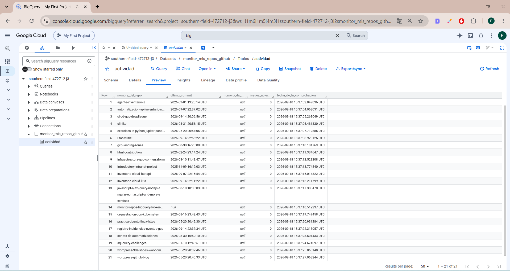
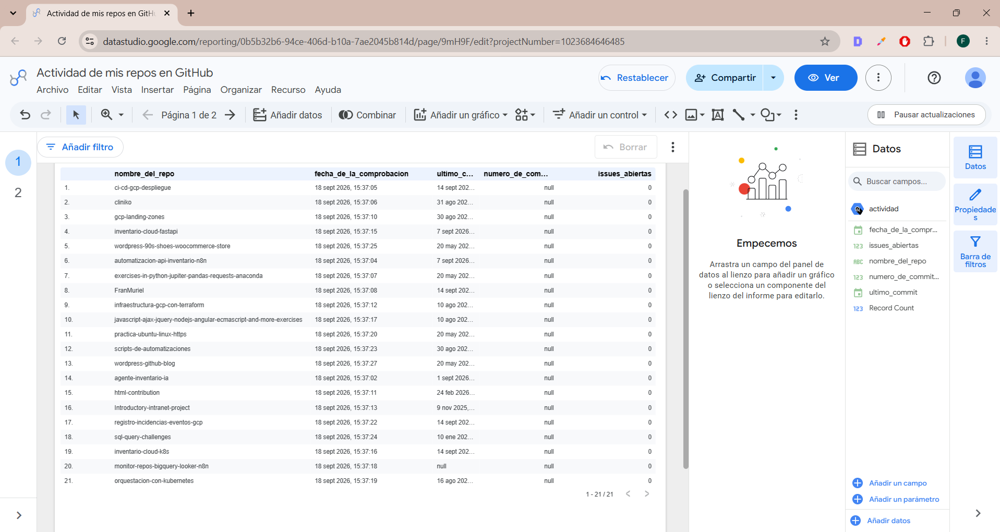
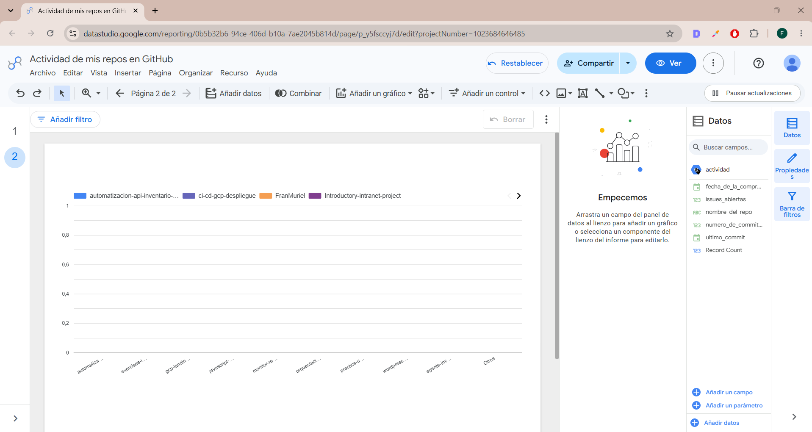
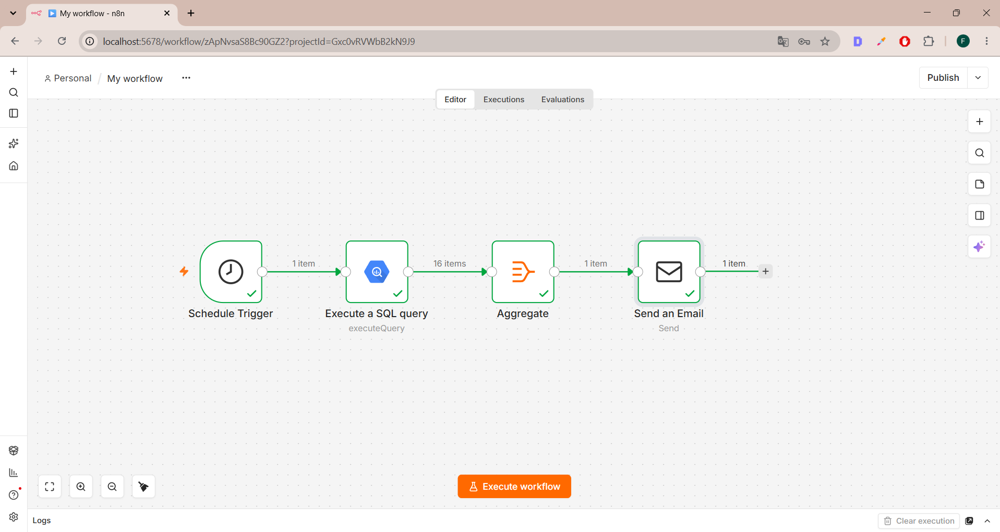
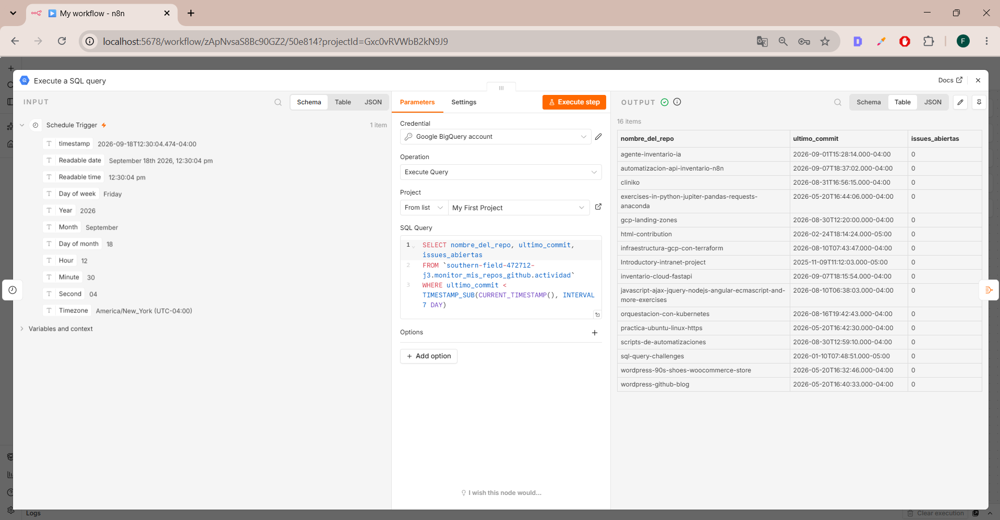
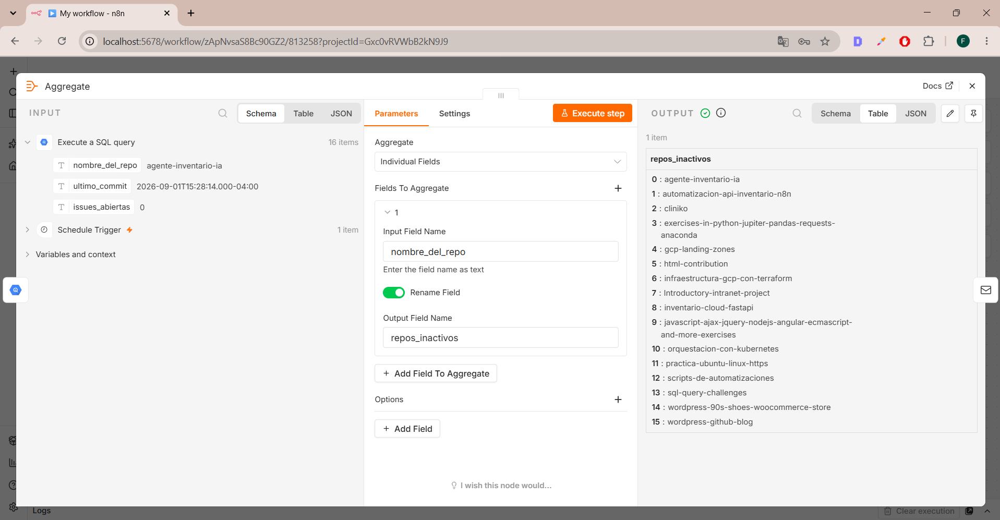
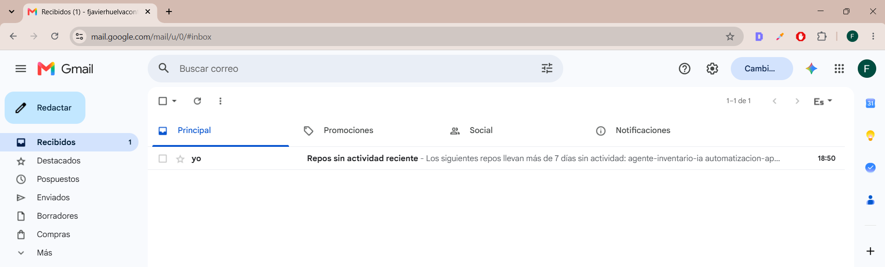
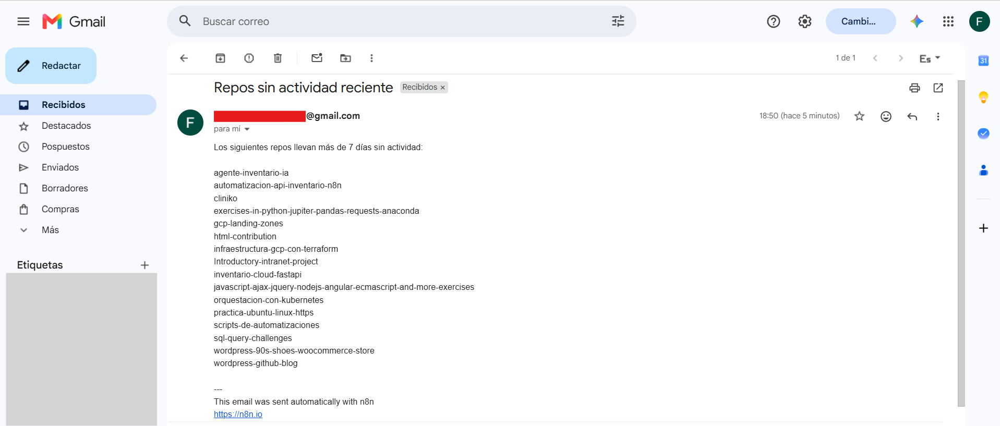

# 📊 Monitorización de actividad de mis repositorios (GitHub + BigQuery + Looker Studio + n8n)

Este proyecto monitorea o está atento de mis propios repositorios de GitHub. Lo que hace es mirar cuándo fue el último commit de cada uno, cuántas issues tengo abiertas, y me avisa por email si algún repo lleva mucho tiempo sin que le toque.

## ¿Qué hace exactamente?

1. Tengo un script en Python que le pregunta a la API de GitHub por todos mis repos, y por ejemplo, cuándo fue su último commit, y cuántas issues tienen abiertas
2. Ese script guarda todos esos datos en una tabla que tengo de BigQuery en GCP
3. Tengo también un dashboard en Looker Studio conectado a esa tabla, para verlo todo de forma clara y también más visual
4. Y tengo un flujo hecho en n8n que revisa esa tabla de vez en cuando, y si ve que algún repo lleva más de 7 días sin actividad, me manda un email avisándome

## 🧠 ¿Cómo es el flujo de funcionamiento?

Primer paso - El script en Python le pregunta a GitHub
Segundo paso - Guardo los datos en BigQuery
Tercer paso - Looker Studio se conecta a esa tabla y me muestra el dashboard
Cuarto paso - n8n revisa la tabla cada cierto tiempo
Quinto paso - Junta todos los repos inactivos en una sola lista
Sexto paso - Me manda un único email con todos ellos

## 🛠️ La infraestructura con Terraform

El dataset y la tabla de BigQuery los creé con Terraform.

## 📸 Capturas

La tabla donde cargo los datos en Bigquery (GCP)


Informe de la tabla con Looker Studio


Gráfico de la tabla en Looker Studio (se ve plano porque tiene establecido como métrica las issues abiertas y los que se muestran tienen 0 abiertas)


El flujo y los nodos creados en la interfaz de n8n


El nodo de Bigquery en n8n con la ejecución de la consulta configurada


El nodo Aggregate que reune los resultados de la consulta en un solo elemento.


La notificación por correo electrónico


Y el contenido de la notificación por correo


## 📁 Estructura del proyecto

```
monitor-repos-bigquery-looker-n8n/
├── app/
│ ├── main.py
│ ├── requirements.txt
│ └── .env (no subido)
├── terraform/
│ ├── main.tf
│ └── variables.tf
├── capturas/
└── README.md
```

## ⚙️ ¿Cómo podrías probarlo?

1. Create un token de acceso personal de GitHub con permiso de lectura sobre los repos
2. Crea los recursos te van a hacer falta de Bigquery y tabla con Terraform:
```bash
   cd terraform
   terraform init
   terraform apply
```
3. Instala las dependencias y ejecuta el código:
```bash
   cd app
   pip install -r requirements.txt
   python main.py
```
4. Conecta Looker Studio a la tabla de BigQuery para poder crear la tabla, gráficos, o lel tipo de informe que quieras.
5. Configura el flujo de n8n con tus propias credenciales de BigQuery y de Gmail

## 🛠️ Tecnologías que se han usado

- Python
- API de GitHub
- BigQuery (GCP)
- Terraform
- Looker Studio
- n8n
- Gmail (SMTP)
